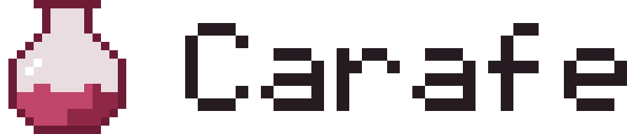

<div align="center">

<picture>
  <source media="(prefers-color-scheme: dark)" srcset="assets/github/banner-dark.png">
  
</picture>

**Bring your Windows games to Nintendo Switch**

[](https://github.com/carafe-nx/carafe/releases)
[](LICENSE)
[](#requirements)

[](https://www.rust-lang.org)
[](https://tauri.app)
[](https://react.dev)
[](https://www.typescriptlang.org)
[](https://www.winehq.org)
[](https://www.docker.com)

</div>

## What it does

Carafe is a desktop app that turns a Windows game folder into a standalone app for a Switch with custom
firmware. The game lands on the HOME Menu with its own icon and starts like any other title — no launcher,
no files to copy to the SD card.

- **Its own icon and name** on the HOME Menu, taken from the game's `.exe` or found on SteamGridDB.
- **Its own save data**, kept by the console like for any other game.
- **A loading screen** while Windows starts up, instead of a black screen.

## How it works

1. **Pick the game folder** on your PC and the `.exe` to start. Carafe suggests a name, an icon and controls.
2. **Build.** Carafe packs the game, a Windows runtime and its settings into an NSP.
3. **Install over USB.** Connect the Switch running DBI and press Install — Carafe copies the NSP for you.

Inside the NSP is a runtime built on [Autorun](https://github.com/autorunhq/autorun): Wine for Horizon OS
with Box64 or FEX to run x86 code, DXVK for Direct3D and Mesa for the GPU.

## Requirements

- A Nintendo Switch with Atmosphère and sigpatches.
- [DBI](https://github.com/rashevskyv/dbi) on the console for installing over USB.
- Windows 10 or 11, x64 or ARM64.

## Download

Get the installer from the [latest release](https://github.com/carafe-nx/carafe/releases/latest):

- `x64-setup.exe` — most Windows PCs;
- `arm64-setup.exe` — Windows on Arm, such as laptops with Snapdragon chips.

The installer speaks English and Russian and installs Carafe for your Windows account, without administrator
rights. From then on Carafe updates itself: when a new version is out, a button appears in the library. If you
have Carafe 0.1, the installer removes it first: confirm removing the old version and allow the administrator
prompt once. Your settings and library stay.

The installer is not signed yet, so Windows may warn about an unknown publisher. Choose **More info** →
**Run anyway** to continue.

## Compatibility

The Switch is a 2017 handheld: older and lighter games run best, and demanding 3D games may not run at all.
Tell others how a game ran in [Compatibility](https://github.com/carafe-nx/carafe/discussions/categories/compatibility)
— every report helps the next player.

## Building from source

Carafe builds on Windows with Git, Docker Desktop, Node.js and Rust:

```
git clone https://github.com/carafe-nx/carafe
cd carafe/app
npm ci
npm run dev
```

The first run builds the Windows runtime in a container and takes a while. Details are in
[CONTRIBUTING.md](CONTRIBUTING.md).

## Credits

Carafe stands on the work of others:

- [Autorun](https://github.com/autorunhq/autorun) — the Windows runtime for Horizon OS, with
  [Wine](https://www.winehq.org), [Box64](https://github.com/ptitSeb/box64), [FEX](https://github.com/FEX-Emu/FEX),
  [DXVK](https://github.com/doitsujin/dxvk) and [Mesa](https://www.mesa3d.org);
- [hacBrewPack](https://github.com/rlaphoenix/hacBrewPack) — builds the NSP;
- [nx-hbloader](https://github.com/switchbrew/nx-hbloader) and [devkitPro](https://devkitpro.org) — the loader
  and the Switch toolchain;
- [Tauri](https://tauri.app) — the desktop app.

## Legal

Carafe is made for games you own. It ships no firmware or games and does not help to obtain them.
Carafe is not affiliated with or endorsed by Nintendo.

## License

Carafe is [GPL-3.0-or-later](LICENSE). The runtime overlay and the Autorun patches are LGPL-2.1-or-later
([`runtime/overlay/LICENSE`](runtime/overlay/LICENSE), [`runtime/patches/LICENSE`](runtime/patches/LICENSE)),
the loader is ISC ([`runtime/loader/LICENSE`](runtime/loader/LICENSE)). Third-party code in `external/` keeps
its own licenses.
